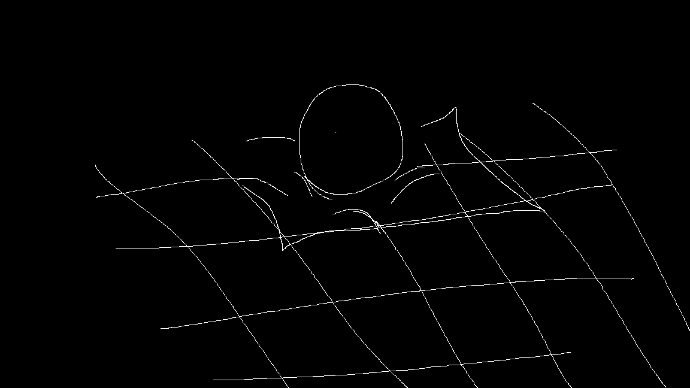

# real time GPU Based 3D Renderer (pygame or moderngl)
---

## overview

this project is a **custom GPU 3d renderer** written in Python built as a playground for

- realtime graphics
- shader experiments
- scene/engine layout
- very simple and customizable oop layout 

  
  

The longterm goal is to turn this into a **physically inspired black hole simulation** using **raytracing / raymarching**, including:

- light bending around the black hole
- disk shading
- redshift blueshift, lensing, etc
- spacetime grid warping around blackhole

  

rn its a small rendering engine with:

- **RendererCore** class that manages camera context and scenes
- **Scene** system that holds a list of objects
- few test objects like a **spacetime grid** with shadertoy robbed fragment shaders
